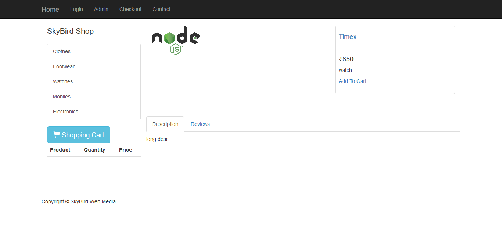
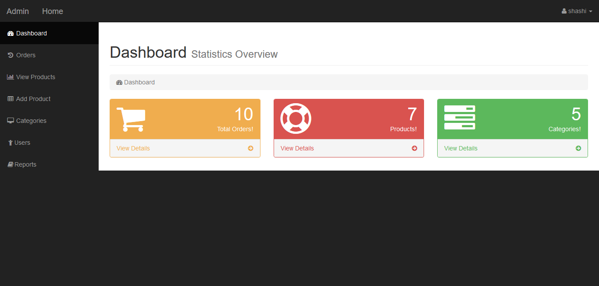
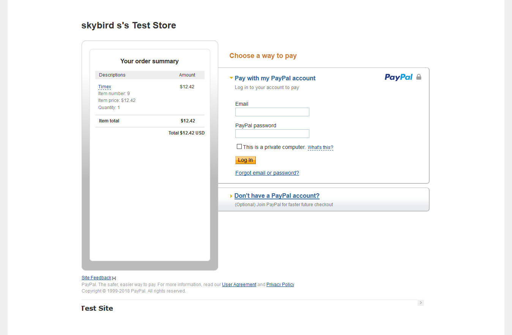

# Ecommerce

# Features
  1. Adding / Editing / Deleting Products
  2. Order Summery
  3. Reports
  4. Paypal payment gateway
  5. Categories Wise Items
  6. Rewrited query string (?id=1 to /id/1)
  7. Sensetive pages are placed in backend side
  8. Secured Admin panel
  9. Helper Functions
  10. Bootstrap
 
# Installation 
  1. Download the Zip File
  2. Edit Config.php
  3. Import Sql
  4. Edit checkout.php for paypal id
  That's All You are Done Hurray!
